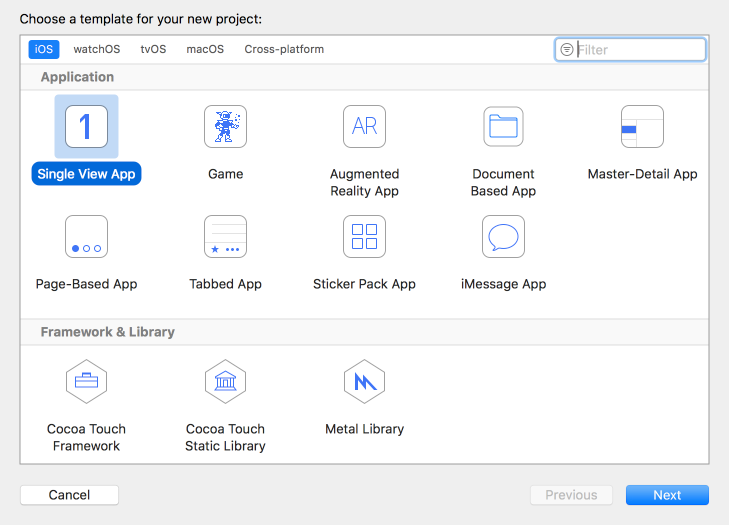
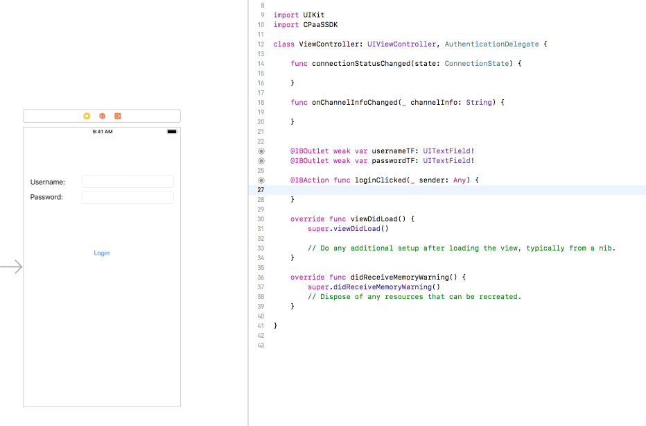
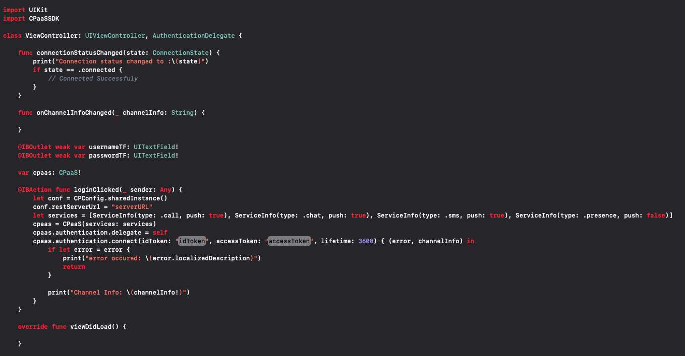

---
  topics:
  - title: Creating the iOS project
    body: In this section you will learn how to create the iOS project using XCode.
  - title: Using the $KANDY$ Mobile SDK in the iOS Project
    body: In this section you will learn how to use the $KANDY$ Mobile SDK in the iOS project.
---
# Get Started

## Base URL

This is the API Marketplace HTTPS entry point that you will use for authentication, REST services and WebSocket notifications.

```
$KANDYFQDN$
```

## ICE Servers

Use these primary and secondary URIs as the ICE Servers in the JavaScript, iOS or Android SDKs configuration when connecting and making calls. This is needed in order to ensure that calls can be established even the call peers are on different networks, behind firewalls. When the ICE server connects, it will try the Primary URL first. If that fails, it will try the Secondary URL.

#### Primary URL:

```
$KANDYICE1$
```

#### Secondary URL:

```
$KANDYICE2$
```

## Installation

This section contains the required steps for beginning your mobile application development by using $KANDY$ Mobile SDK in the Xcode iOS project.

## Compatible XCode and Swift Versions

The applications which uses $KANDY$ MobileSDK can be built with the XCode 10.2+ and Swift 4.2+ versions.

## Creating the iOS project

1. Open the Xcode application.
2. Click Create a new Xcode project.
3. Click **iOS** heading, select **Single View App**, and click **Next**.



4. Type the project details and click **Create**.
5. Select one of the installation methods below

### Cocoapods installation
1. Add below pods to your Podfile (If you dont have any Podfile, visit this link to install cocoapods: https://guides.cocoapods.org/using/using-cocoapods.html)

* pod 'KandyCPaaSMobileSDK'

2. Go to project folder via command line and run "pod install" command and wait for cocoapods to finish installation of Kandy CPaaS MobileSDK & WebRTC frameworks and their dependencies

### Manual Installation
1. Go to project settings and navigate to **Build Phases**.
2. Add **CPaaSSDK.framework** under **Link Binary With Libraries** section.


3. Add the following frameworks to the project under the **Link Binary With Libraries**:
	* AvFoundation.framework
	* SystemConfiguration.framework
	* CFNetwork.framework
	* Security.framework
	* OpenGLES.framework
	* QuartzCore.framework
	* AudioToolbox.framework
	* CoreAudio.framework
	* CoreMedia.framework
	* CoreVideo.framework
	* CoreGraphics.framework
	* UIKit.framework
	* Foundation.framework
	* GLKit.framework
	* libc++.tbd
	* libsqlite3.tbd
	* libstdc++.6.0.9.tbd
	* libstdc++.tbd
	* libicucore.tbd

4. Add WebRTC.framework under the **Embedded Binaries** section in **General** tab on Project Settings. Select **Copy items if needed**.
5. Under the **Build Settings** section, search for **Framework Search Paths** and add the following:

  `$(PROJECT_DIR)/CPaaSSDK.framework/SubFrameworks/`

  **Note:** If framework is located in different place rather than main directory of project, above line should be modified accordingly.

**CPaaS SDK** is now ready to implementation.


6. The following part shows how to use **$KANDY$ Mobile SDK** with basic features. While codes are shared for both *Swift* and *Objective-C* languages, some parts may need different implementations, are also indicated.

  **If the project language is selected as *Swift*, do the following:**
  * Navigate to the **Build Settings** in the project settings.
  * Search for **Other Linker Flags** listed under the **Linking** and click.
  * Click **+** button in the list appeared next under to the **Other Linker Flags**.
  * Type *-ObjC* and close the panel.

  

  * In order to run framework, search for **Enable Bitcode** option listed under the **Build Options**, and change it to the **NO**.

  $KANDY$ Mobile SDK is now ready to use in the application.

### Using the $KANDY$ Mobile SDK in the iOS Project
1. Open *Main.storyboard* and create a basic user interface which contains username, password text fields, and login button.
2. Set **AuthenticationDelegate** to view controller and add protocol stubs.



3. In order to set configurations for registering to $KANDY$, add followings in to login action.

*Swift Code:*
```swift
import CPaaSSDK

let configuration = CPConfig.sharedInstance()
configuration.restServerUrl = ""$KANDYFQDN$""
configuration.restServerPort = "443"
configuration.useSecureConnection = true
```
*Objective-C Code:*
```objective-c
@import CPaaSSDK;

CPConfig *configuration = [CPConfig sharedInstance];
configuration.restServerUrl = @""$KANDYFQDN$"";
configuration.restServerPort = @"443";
configuration.useSecureConnection = YES;
```

4. When all configurations are set correctly, connect method can be called as following.

*Swift Code:*
```swift
import CPaaSSDK

let services = [CPServiceInfo(type: .call, push: true), CPServiceInfo(type: .chat, push: true), CPServiceInfo(type: .sms, push: true)]

cpaas = CPaaS(services: services)
cpaas.authentication.delegate = self
cpaas.authentication.connect(idToken: <ID-Token>, accessToken: <Access-Token>, lifetime: 3600) { (error, channelInfo) in
    if let error = error {
        print("error occured: \(error.localizedDescription)")
        return
    }

    print("Channel Info: \(channelInfo!)")
}
```
*Objective-C Code:*
```objective-c
@import CPaaSSDK;

NSArray* services= @[[CPServiceInfo buildWithType:CPServiceTypeSms push:YES],
                    [CPServiceInfo buildWithType:CPServiceTypeCall push:YES],
                    [CPServiceInfo buildWithType:CPServiceTypeChat push:YES]];

cpaas = [[CPaaS alloc] initWithServices: services];
cpaas.authentication.delegate = self;
[cpaas.authentication connectWithIdToken:<ID-Token> accessToken:<Access-Token> lifetime:lifetime completion:^(CPError * _Nullable error, NSString * _Nullable channelInfo) {
        if (error) {
        	NSLog(@"error occured: %@", error.localizedDescription);
        	return
        }

        NSLog(@"Channel Info: %@", channelInfo);
}];
```

5. When $KANDY$ is registered, **connectionStatusChanged(state:)** method will be called by *AuthenticationDelegate*.


